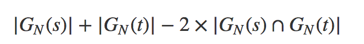
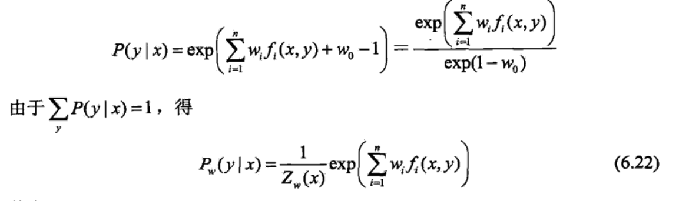
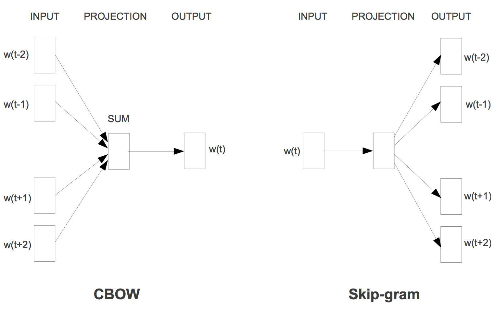
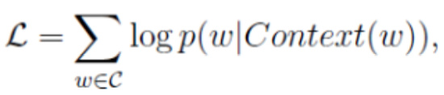
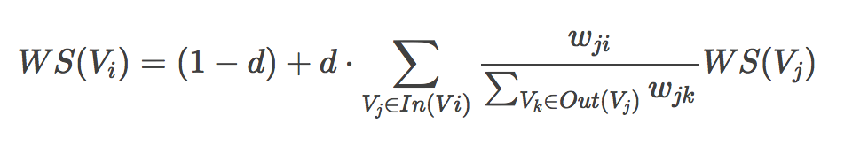
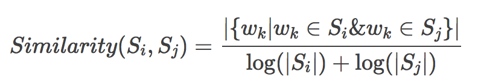

# NLP with Deep Learning

#### 前言

在网易实习的时候开始正式的接触NLP，之前就只是做过一个基于keras的binary情感分类问题。不得不说，这个去年的TER启了一个启蒙的作用，让我第一次的使用dl处理问题，体会到DL的神奇。但是，不知道是老师懒还是啥，学完其实还是不是很明白DL是干啥的，当时也不明白NLP和图像两大类的分别啥的。答辩的时候，居然连当时用的啥作为loss function都不知道。

## 1. jieba 分词

 之前由于是在英语的环境下操作的project，所以在分词这一块，当时只需要利用空格和标点符号进行分割就可以了。中文由于其模糊性，必须先采用分词的方法，将文本句子分成一个个词语的结构。工作的时候采用的是jieba分词，由于是在jupyter notebook来链接的远程服务器，所以可以采用以下命令来安装。

```text
！pip3.6 install jieba --user
```

 中文分词的模型实现主要分类两大类：基于规则和基于统计。

基于规则的方法，实际上就是维护一个大的trie树。Fabian在Knowledge Base Construction里面已经有所介绍了，可以采用使用前向最大匹配，即从前向后扫描，使分出来的词存在于词典中并且尽可能长。

 常用的基于统计的分词模型还有HMM（Hidden Markov Model）和CRF（Conditional Random Field）等，以及将中文分词视为序列标注问题（BEMS，即将每个字标注成Begin、End、Middle、Single中的一个，输入字序列，输出标签序列），进而使用有监督学习、深度神经网络等模型进行中文分词。

HMM，

 jieba分词结合了基于规则和基于统计两类方法。

分词过程：给定待分词的句子, 使用正则获取连续的 中文字符和英文字符, 切分成 短语列表, 对每个短语使用DAG\(查字典\)和动态规划, 得到最大概率路径, 对DAG中那些没有在字典中查到的字, 组合成一个新的片段短语, 使用HMM模型进行分词, 也就是作者说的识别新词, 即识别字典外的新词.

1.利用trie树

结巴分词自带了一个叫做dict.txt的词典, 里面有2万多条词, 包含了词条出现的次数\(这个次数是于作者自己基于人民日报语料等资源训练得出来的\)和词性. 这个第一条的trie树结构的词图扫描, 说的就是把这2万多条词语, 放到一个trie树中, 而trie树是有名的前缀树, 也就是说一个词语的前面几个字一样, 就表示他们具有相同的前缀, 就可以使用trie树来存储, 具有查找速度快的优势. 在python中可以通过嵌套字典的形式建立。

```text
def init(self):
    self.tree={}
def add(self,word):
    node=self.tree
    for char in word:
        if char in node:
            node=node[char]
        else:
             node[char]={}
             node=node[chat]
```

2. 采用了动态规划查找最大概率路径, 找出基于词频的最大切分组合

 字典在生成trie树的同时, 也把每个词的出现次数转换为了频率. 动态规划中, 先查找待分词句子中已经切分好的词语, 对该词语查找该词语出现的频率\(次数/总数\), 如果没有该词\(既然是基于词典查找, 应该是有的\), 就把词典中出现频率最小的那个词语的频率作为该词的频率, 也就是说P\(某词语\)=FREQ.get\(‘某词语’,min\_freq\), 然后根据动态规划查找最大概率路径的方法, 对句子从右往左反向计算最大概率\(一些教科书上可能是从左往右, 这里反向是因为汉语句子的重心经常落在后面, 就是落在右边, 因为通常情况下形容词太多, 后面的才是主干, 因此, 从右往左计算, 正确率要高于从左往右计算, 这个类似于逆向最大匹配\), P\(NodeN\)=1.0, P\(NodeN-1\)=P\(NodeN\)\*Max\(P\(倒数第一个词\)\)…依次类推, 最后得到最大概率路径, 得到最大概率的切分组合.

3. 对于未登录词，采用了基于汉字成词能力的HMM模型，使用了Viterbi算法

未登录词, 作者说的是什么意思? 其实就是词典 dict.txt 中没有记录的词. 上面说了, 把dict.txt中的所有词语都删除了, 结巴分词一样可以分词, 就是说的这个.

怎么做到的? 这个就基于作者采用的HMM模型了, 中文词汇按照BEMS四个状态来标记, B是开始begin位置, E是end, 是结束位置, M是middle, 是中间位置, S是singgle, 单独成词的位置, 没有前, 也没有后. 也就是说, 他采用了状态为\(B,E,M,S\)这四种状态来标记中文词语, 比如北京可以标注为 BE, 即 北/B 京/E, 表示北是开始位置, 京是结束位置, 中华民族可以标注为BMME, 就是开始, 中间, 中间, 结束.

### N-gram:

N-Gram是一种基于统计语言模型的算法。它的基本思想是将文本里面的内容按照字节进行大小为N的滑动窗口操作，形成了长度是N的字节片段序列。

应用：

#### N-gram距离，也就是字符串s 中所有长度为 N 的子字符串。以非重复的N-Gram分词为基础来定义 N-Gram距离这一概念。



#### 利用N-Gram模型评估语句是否合理

我们有一个由 m个词组成的序列（或者说一个句子），我们希望算得概率 P\(w1,w2,⋯,wm\)尽可能的大，根据链式规则，可得 


引入马尔可夫假说，每个词与前几个词有关。n一般取2或者3，n=2时代表仅仅与前一个词有关


贝叶斯网络（信念网络）都是有向的，马尔科夫网络无向。所以，贝叶斯网络适合为有单向依赖的数据建模，马尔科夫网络适合实体之间互相依赖的建模

### HMM模型：

马尔可夫模型，最大假设在于随机变量序列不是相互独立的，而是依赖于前面的几个状态项，一阶马尔可夫链为以来前面一个状态。两个重要的量状态，转移矩阵。

补充在基本的马尔科夫链时假设为当前`T=i`时刻的状态`Status(i)`，只和`T=i`时刻之前的n个状态有关。HMM中，有5个基本元素：{N,M,A,B,π}


* N:状态的有限集合。每一个词语背后的标注。
* M:观察值的有限集合。每一个词语本身。
* A:状态转移概率矩阵。某一个标注转移到下一个标注的概率。即P\(O\|O-1\)
* B:观测概率矩阵，也就是发射概率矩阵。在某个隐藏状态标注下，生成某个词的概率。P\(I\|O\)
* π:初始概率矩阵。在这里，是指每一个隐藏状态标注的初始化概率。

隐马尔可夫模型是关于**时序**的概率模型，描述由一个**隐藏的马尔可夫链随机生成不可观测的状态随机序列，再由各个状态生成一个观测而产生观测随机序列的过程。**

**隐藏的马尔可夫链随机生成的状态的序列，称为状态序列（state sequence\);每个状态生成一个观测，而由此产生的观测的随机序列，称为观测序列（observation sequence\)。**

隐马尔科夫模型的两个基本假设

（1）：设隐马尔科夫链在任意时刻t的状态只依赖于**其前一时刻**的状态，与其他时刻的状态及观测无关，也与时刻t无关。（**齐次马尔科夫性假设**）所以状态转移矩阵只是一个二维数组

（2）：假设任意时刻的观测只依赖于该时刻的马尔科夫链的状态，与其他观测和状态无关。（**观测独立性假设**） **输出仅与当前状态有关。所以只有一个二维的混淆矩阵**

HMM中说到的马尔可夫链其实是指隐含状态链，因为隐含状态（骰子）之间存在转换概率（transition probability）

HMM模型可以用来解决三种问题：

1. 其它参数\(StatusSet,TransProbMatrix,EmitRobMatrix,InitStatus\)已知的情况下，求解**观察值序列**。\(`Forward-backward`算法\)
2. 其它参数\(ObservedSet,TransProbMatrix,EmitRobMatrix,InitStatus\)已知的情况下，词性标注，求解**状态值序列**。\(`viterbi`算法\)
3. 其它参数\(ObservedSet\)已知的情况下，不知道隐藏状态的数目，相当于无监督学习呐求解**\(TransProbMatrix,EmitRobMatrix,InitStatus\)**。\(`Baum-Welch`算法\)

前向算法用以解决已知模型参数，求解观测序列概率的算法。暴力求解时间复杂度高为O\(TN^T\)。用DP的思想，定义时刻他时隐藏状态为q，观测状态序列为o1,o2,...ot的概率。 时间复杂度为O\(TN^2\).T 代需要标注的序列长度，N代表隐藏状态长度

Viterbi algorithm

build a graph for the problem. The path means the hidden state.

Step 1 Forward Search

遍历所有可能的path，更新每个节点best score和best edge

Step 2 Backward

从最后的节点开始反推，loop寻找每次的最佳path和对应的node，直至前面无path

问题在于HMM算法默认只考虑前一个状态（词）的影响，忽略了更多上下文信息（特征）

### MEMM，即最大熵马尔科夫模型

使熵最大的概率分布最真实地反应了时间的分布情况，熵最大时随机变量最不确定，最难准确预测行为。条件熵最大的模型称为最大熵模型，在带有约束的情况下，将原问题引入拉格朗日算子，并且转化为对偶问题。对其求偏导



一个随机事件的概率分布进行预测时，我们的预测应当满足全部已知条件，而对未知的情况不要做任何主观假设。在这种情况下，概率分布最均匀，预测的风险最小。这时概率分布的信息熵最大。计算判定结果a的条件概率P\(a\|b\)最大的候选结果最为最终的判定结果。P\(a\|b\)=argmaxH\(p\). 

$$
H(p) = H(A|B)  
          = sum p(b)H(A|B=b) = sum  p(b)p(a|b) log p(a|b)
$$

观测序列是需要很多的特征来刻v画的，所以MEMM能够直接允许**“定义特征”**，直接学习条件概率。这个概率通过最大熵分类器建模（取名MEMM的原因）


MEMM当前隐藏状态  应该是依赖当前时刻的观测节点  和上一时刻的隐藏节点 **我认为从神经网络的角度看，最大熵模型就是由一层最简单的前向神经网络加上softmax激活函数构成的一个分类模型**

由于分支数不同，概率的分布不均衡，导致状态的转移存在不公平的情况。标注偏置问题存在于最大熵马尔可夫模型（MEMM）中，虽然MEMM解决了HMM输出独立性假设的问题，但是只解决了观察值独立的问题，状态之间的假设则是标注偏置问题产生的根源。因为还是假设状态之间会有前后顺序序列问题，那么实际在操作时可以将至当作时在对序列的每一个部分分步建模最后累乘，所以这个时局部归一。

但隐马模型一个最大的缺点就是由于其输出独立性假设，导致其不能考虑上下文的特征，限制了特征的选择，而最大熵隐马模型则解决了这一问题，可以任意的选择特征，但由于其在每一节点都要进行归一化，所以只能找到局部的最优值，同时也带来了标记偏见的问题（label bias），即凡是训练语料中未出现的情况全都忽略掉

### CRF

广义的CRF的定义是： 满足P\(Yv\|X,Yw,w≠v\)=P\(Yv\|X,Yw,w∼v\)的马尔科夫随机场叫做条件随机场（CRF）
CRF通过定义条件条件概率P(Y|X)，而不是联合概率分布P(X,Y)来描述模型。


linear chain CRF， CRF where the neighbourhood graph is a chain.


tk定义在边上的特征函数，称为转移特征，依赖于当前和前一个位置 ,st定义在及结点上的特征函数，称为状态特征，依赖于当前位置

将三者放在一块做一个总结：

1. HMM -&gt; MEMM： HMM模型中存在两个假设：一是输出观察值之间严格独立，二是状态的转移过程中当前状态只与前一状态有关。但实际上序列标注问题不仅和单个词相关，而且和观察序列的长度，单词的上下文，等等相关。MEMM解决了HMM输出独立性假设的问题。因为HMM只限定在了观测与状态之间的依赖，而MEMM引入自定义特征函数，不仅可以表达观测之间的依赖，还可表示当前观测与前后多个状态之间的复杂依赖。仍然存在有限历史性假设，认为Yt只取决于Yt-1
2. MEMM -&gt; CRF:

* CRF不仅解决了HMM输出独立性假设的问题，还解决了MEMM的标注偏置问题，MEMM容易陷入局部最优是因为只在局部做归一化，而CRF统计了全局概率，在做归一化时考虑了数据在全局的分布，而不是仅仅在局部归一化，这样就解决了MEMM中的标记偏置的问题。使得序列标注的解码变得最优解。
* HMM、MEMM属于有向图，所以考虑了x与y的影响，但没讲x当做整体考虑进去（这点问题应该只有HMM）。CRF属于无向图，没有这种依赖性，克服此问题。
* MEMM可以视为一个多分类问题，相当于在序列标注中的每一步都在做一个分类，将各个步骤上的分类做点积形成其，做了T次多e分类。CRF相当于直接对整个序列进行建模求解。

## 2. Word2Vec

由于Word2Vec是分布式表示：分布式表示的假说在于：上下文相似的词，其寓意也相似。基于神经网络的分布表示称为word Embedding。Word2Vec是其中一种word Embedding.提出了一种更快更好的方法来训练语言模型。

在中文分完词之后，其实要做的剩下的工作和英文是一样的，即将word向量化的表示。在这里采用的的是业界广泛用的Word2Vec，算半监督学习，虽然在训练的过程中有标注，但是这个标注会因为选用的语料变化而改变，不是一个ground truth。_窗口设置一般是5，而且是左右随机1-5的大小，是均匀分布。随机窗口比固定窗口效果要好，增加随机性。负采样很重要，一般设置是10左右，如果更大会有小量的提升。fasttext构建的词向量对于未登陆词更友好，因为采用了n-gram的方式来刻画这个词，所以对新词相对来说更好。

无监督学习，没有grand truth，不需要先验只是。

补充：**N-gram模型**


根本是为了令序列中所有词出现概率最大。它的假设条件在考虑P\(w\|context\)时，不考虑词典中所有的word，只考虑在该单词前出现的前n个单词。出现量级考虑，一般n取2或者3,代表在考虑P（word\|context）时，只看单词前的2到3个单词作为它的上下文

在word2vec中有两个算法：

* Skip-grams \(SG\)：预测上下文
* Continuous Bag of Words \(CBOW\)：预测目标单词

两种稍微高效一些的训练方法：

* Hierarchical softmax
* Negative sampling

网络结构：



Cbow是利用context来预测中心词，SG是通过中心词来预测上下文

### CBOW

h=1/C*W*(sum one_hot vector)



Loss Function就是负的goal function也称为cross-entropy

### 交叉熵

提到交叉熵，在实习面试的时候已经被问了好多次了。做一个正式的总结。

由相对熵\(relative entropy\)又称为KL散度（Kullback-Leibler divergence），KL距离，是两个随机分布间距离的度量。记为DKL\(p\|\|q\)DKL\(p\|\|q\)。它度量当真实分布为p时，假设分布q的无效性。 p=q时，KL散度为0.

CEH\(p,q\)=Ep\[−logq\]=−∑x∈Xp\(x\)logq\(x\)=H\(p\)+DKL\(p\|\|q\)CEH\(p,q\)=Ep\[−log⁡q\]

=−∑ p\(x\)log⁡q\(x\)=H\(p\)+DKL\(p\|\|q\) 

 交叉熵与上一节定义的相对熵仅相差了H\(p\),当p已知时，可以把H\(p\)看做一个常数，此时交叉熵与KL距离在行为上是等价的，都反映了分布p，q的相似程度。最小化交叉熵等于最小化KL距离。

 在logistic regression中，   
p:真实样本分布，服从参数为p的0-1分布，即X∼B\(1,p\)  
q:待估计的模型，服从参数为q的0-1分布，即X∼B\(1,q\)

CEH\(p,q\)=-\(P\(x=0\)logQ\(x=0\)+P\(x=1\)logQ\(x=1\)\)

=-\(\(1-p\)log\(1-q\)+plog\(p\)\)

=-\(\(1-y\)log\(1-h\(x\)\)+ylong\(h\(x\)\)\)


 多分类的问题上，

真实的类标签可以看作是分布，对某个样本属于哪个类别可以用One-hot的编码方式，是一个维度为C的向量，比如在5个类别的分类中，`[0, 1, 0, 0, 0]`表示该样本属于第二个类，其概率值为1。我们把真实的类标签分布记为p，该分布中，ti=1当i属于它的真实类别c  
CEH\(p,q\)=−∑ label\(x\)log⁡q\(x\)

意义：

1.交叉熵本身可以衡量模型分布和真实分布的相似程度

2.利用交叉熵权重参数的偏导数由σ\(z\)−y控制，模型的输出与标签y之间的偏差越大，也就是σ\(z\)−y的值越大，那么偏导数就会越大，学习就会越快.cross entropy 计算 loss，则依旧是一个凸优化问题，用梯度下降求解时，凸优化问题有很好的收敛特性, 若采用MSE则有多个局部最优解, 并且预测值接近真实值\(即σ\(z\) 或者\(1−σ\(z\)\)接近0时，更新项η⋅\(a−y\)⋅σ\(z\)⋅\(1−σ\(z\)\)接近0，梯度出现“消失”现象


**输入层**是上下文的词语的词向量，此时的词向量即为该单词的one-hot矩阵（什么！我们不是在训练词向量吗？不不不，我们是在训练CBOW模型，词向量只是个副产品，确切来说，是CBOW模型的一个参数。训练开始的时候，词向量是个随机值，随着训练的进行不断被更新）。

 **投影层**对其求和，所谓求和，就是简单的向量加法。即实际额context（w）为在一个window中出现的单词的one-hot矩阵相加的结果

 **输出层**输出最可能的中心词word。由于语料库中词汇量是固定的\|C\|个，所以上述过程其实可以看做一个多分类问题。给定特征，从\|C\|个分类中挑一个。这里的ground truth为文本中真正的中心词的one-hot表示。

 相当于在最后的output时采用了softmax回归，需要对语料库中每个词语（类）都计算一遍输出概率并进行归一化，在几十万词汇量的语料上无疑是令人头疼的。

所以在以上 基础上考虑使用近似的模拟方法进行加速运算。

 U为context word vector， V为center word vector

### **hierarchical Softmax**

 在输出层采用二叉树形结构即为Hierarchical Softmax。非叶子节点相当于一个神经元（感知机，我认为逻辑斯谛回归就是感知机的输出代入f\(x\)=1/\(1+e^x\)），二分类决策输出1或0，分别代表向下左转或向下右转；每个叶子节点代表语料库中的一个词语，于是每个词语都可以被01唯一地编码，并且其编码序列对应一个事件序列，于是我们可以计算条件概率P\(w\|context\(w\)\)。

 从根节点出发，到达指定叶子节点的路径是唯一的。Hierarchical Softmax正是利用这条路径来计算指定词的概率，而非用softmax来计算。

Hierarchical Softmax，建立一颗Huffman树。Huffman 树，就是跳出权重最小两个节点组合成为一个新的节点，然后再与之前节点进行同样的操作，直至list为空。每次前进，相当于进行一次逻辑回归的过程，

 因此对于模型来说就是，词频越高的词，距离根节点就越近。每次选择就是一次LR的分类，LR output为1时则代表向左转，output为0则代表为向右转。此时的LR为：sigmoid（u\*v） 

任何二叉树都可以作为构造编码。Huffman树只是二叉树中具体的一种，特别适合word2vec的训练。

word2vec训练的时候按照词频将每个词语Huffman编码，由于Huffman编码中词频越高的词语对应的编码越短。所以越高频的词语在Hierarchical Softmax过程中经过的二分类节点就越少，整体计算量就更少了

### **Negative Sampling**

 把语料中的一个词串的中心词替换为别的词，**构造语料** D **中不存在的词串作为负样本**。因此在这种策略下，优化目标变为了：**最大化正样本的概率，同时最小化负样本的概率**。对于一个词串 \(w,c\) （ c 表示 w 的上下文），用二项Logistic回归模型对其是正样本的概率建模。

这样其实就巧妙的避开了softmax问题，将之变成了二分的问题。

 P\(D=1\|w,c\)=σ\(u⊤\(w\)v\(c\)\)

 goal function在只有一个单词时就为：∏\(w,c\)∈DP\(D=1\|w,c\)∏\(w,c\)∉D\(1−P\(D=1\|w,c\)\)

此时D即为不存在 词串。

### 工程实践

在工程实践中，我采用了2000万投顾与顾客的聊天语句作为语料，当然是分好词的句子。分词和读取数据是最消耗时间的部分，反而直接用word2vec进行训练的时间很短，40分钟左右搞定了。采用的是CBOW和负采样，dimension为300

word2vec训练参数如下，window=5, min_count=5, workers=4。window即为滑窗的尺寸，min\__count为忽略词频低于5的词，worker即多线程操作, **size** \(_int_\) – Dimensionality of the feature vectors. 

**hs, negative** ： 代表采用的加速方式，sg来选择用何种方法训练

这些基于计数的方法在中小规模语料训练很快，有效地利用了统计信息。但用途受限于捕捉词语相似度，也无法拓展到大规模语料。

而NNLM, HLBL, RNN, Skip-gram/CBOW这类进行预测的模型必须遍历所有的窗口训练，也无法有效利用单词的全局统计信息。但它们显著地提高了上级NLP任务，其捕捉的不仅限于词语相似度。

  
GLOVE没用过，据说结合了两者的优点，但是没有尝试。

## 3.神经网络中关于激活函数的选择和优缺点

 **Sigmoid函数**

优点：（1）便于求导的平滑函数；

    （2）能压缩数据，保证数据幅度不会有问题；

    （3）适合用于前向传播。

缺点：（1）容易出现梯度消失（gradient  vanishing）的现象：当激活函数接近饱和区时，变化太缓慢，导数接近0，根据后向传递的数学依据是微积分求导的链式法则，当前导数需要之前各层导数的乘积，几个比较小的数相乘，导数结果很接近0，从而无法完成深层网络的训练。导数最大值仅为1/4，连乘之后当层数比较大的时候，导数太小了。

    （2）Sigmoid的输出不是0均值（zero-centered）的：这会导致后层的神经元的输入是非0均值的信号，这会对梯度产生影响。以 f=sigmoid\(wx+b\)为例， 假设输入均为正数（或负数），那么对w的导数总是正数（或负数），这样在反向传播过程中要么都往正方向更新，要么都往负方向更新，导致有一种捆绑效果，使得收敛缓慢。

    （3）幂运算相对耗时

 **tanh函数**

tanh函数将输入值压缩到 -1~1 的范围，因此它是0均值的，解决了Sigmoid函数的非zero-centered问题，但是它也存在梯度消失和幂运算的问题。

其实 tanh\(x\)=2sigmoid\(2x\)-1  


 **ReLU函数：全区间不可导**

优点：（1）SGD算法的收敛速度比 sigmoid 和 tanh 快；（梯度不会饱和，解决了梯度消失问题）

    （2）计算复杂度低，不需要进行指数运算；

    （3）适合用于后向传播。

缺点：（1）ReLU的输出不是zero-centered；

    （2）Dead  ReLU  Problem（神经元坏死现象）：某些神经元可能永远不会被激活，第一次输入为负就会导致这个神经元再也不会激活，导致相应参数永远不会被更新（在负数部分，梯度为0）。产生这种现象的两个原因：参数初始化问题；learning  rate太高导致在训练过程中参数更新太大。 解决方法：采用Xavier初始化方法，以及避免将learning  rate设置太大或使用adagrad等自动调节learning  rate的算法。

    （3）ReLU不会对数据做幅度压缩，所以数据的幅度会随着模型层数的增加不断扩张。  
 **Leakly  ReLU函数**

 用来解决ReLU带来的神经元坏死的问题，可以将0.01设置成一个变量a，其中a由后向传播学出来。但是其表现并不一定比ReLU好。

## 4. RNN及其变种

RNN与HMM的本质区别是RNN没有马尔科夫假设，可以考虑很长的历史信息。另外HMM本质是一个概率模型，而RNN不是。hmm是onehot, RNN是分布表示，RNN的表示能力强很多，或者说在面对高维度时，表示效率更高。

#### 1.经典的RNN


 新的语言模型是利用RNN对序列建模，复用不同时刻的线性非线性单元及权值，理论上之前所有的单词都会影响到预测单词。所以从概率上考虑这个rnn就相当于P\(xt\|xt-1,....x1\)

 给定一个词向量序列： x1,...,xt−1,xt,xt+1,...xT在每个时间点上都有隐藏层的特征表示： 

ht=σ\(W\(hh\)ht−1+W\(hx\)xt\)

xt: t时刻输入的单词的词向量。在图像处理中就应该是每行的pixel集合。num\_in_put: 词向量的维度,  num\_step:多少的词，对图像来说就该是有多少的行的el_

W\(hx\):  用来condition输入词向量xt的的权值矩阵。

W\(hh\): 用来condition前一个时间节点隐藏层特征表示ht−1的权值矩阵。

ht-1: 前一个时间点 t−1的非线性激活函数的输出

yt=softmax\(W\(S\)ht\)：在时刻t时输出的整个词表 \|V\| 上的概率分布，yt是给定上文ht−1和最近的单词 x\(t\)预测的下一个单词。其中W\(S\)∈R\|V\|×Dh， y^∈R\|V\|。

 整个序列的预测是之前每个时刻的误差之和，而每个时刻t的预测误差又是之前每个时刻的误差之和\(损失函数的一种定义方式，也可在每个时刻计算交叉熵损失函数并在序列上平均）。 

**缺点：**

指数项\(βWβh\)t−k在βWβh显著地大于或小于1的时候，经过足够多的t−k次乘法之后就会趋近于0或无穷大。小于1更常见，会导致很长时间之前的词语无法影响对当前词语的预测。

而大于1时，浮点数运算会产生溢出（NaN），一般可以很快发现。这叫做梯度爆炸。小于1，或者下溢出并不产生异常，难以发现，但会显著降低模型对较远单词的记忆效果，这叫做梯度消失。

#### 防止梯度爆炸 {#h3-6}

一种暴力的方法是，当梯度的长度大于某个阈值的时候，将其缩放到某个阈值。虽然在数学上非常丑陋，但实践效果挺好。使用relu激活函数。

#### 减缓梯度消失 {#h3-7}

与其随机初始化参数矩阵，不如初始化为单位矩阵。

### GRU

compare with RNN, the difference is following:


1. reset gate:  the input of reset gate is x\(t\) and hidden state of last moment 

                                      rt=σ\(W\(r\)xt+U\(r\)ht−1\). 

    2. update gate: the same input

                                      zt=σ\(W\(z\)xt+U\(z\)ht−1\)

We will use the reset gate and last moment hidden state and input word vector X, to get the new memory. The reset gate 计算new memory时保留多少上一层hidden state的信息. 

The update gate 将会计算在最终的hidden state 时发挥作用，决定用多少的last hidden state与new memory.

Q:为什么它可以解决梯度消失与梯度爆炸问题  
A:1. 在标准的RNN中，梯度是严格的按照所有的中间节点流动的，而GRU在网络中创造了适应性的短连接（create adaptive shortcut connection）。在GRU中，可以选择性的遗忘和记忆此前的信息，在梯度的流动中做了短连接，避免梯度计算中的大量累积。   
2. 通过GRU公式，ht=zt∗ht−1+\(1−zt\)ht˜，其中zt是update gate的值，ht是当前时刻的新信息。为了方便可做简化：ht=ht−1+\(1−zt\)ht˜，可以看到ht和ht−1此时是线性关系，不再是RNN中ht=f\(Whhht−1+Whsxt\)的乘积关系，因此梯度在计算的时候不再是连乘关系。梯度在中间节点线性流动，就会保持很长时间的记忆。

### LSTM


  compare with RNN, the difference is following:

1.input gate

2. forget gate

3. output gate

4. memory cell

forget gate 与 input gate将在计算final memory cell时发生作用，input决定采用多少 new memory cell，forget决定采用多少上一层cell的记忆。output将会决定最终将多少的cell 信息输出

 Question1: How do LSTM fix vanishing gradient problem?\(LSTM如何解决梯度弥散的问题？\)   
　　1. 在标准的RNN中，梯度是严格的按照所有的中间节点流动的，而LSTM在网络中创造了适应性的短连接（create adaptive shortcut connection）。在LSTM中，可以选择性的遗忘和记忆此前的信息，在梯度的流动中做了短连接，避免梯度计算中的累积。   
　　2. 通过公式也可以看出，在LSTM中，Ct=ft∗Ct−1+it∗Ct˜，其中Ct−1是此前的信息，Ct˜是当前时刻的新信息，Ct是最终的信息。可以看到Ct和Ct−1此时是线性关系，不再是RNN中的乘积关系，因此梯度在计算的时候不再是连乘关系，梯度以线性在中间节点流动，因此就会保证很长时间的记忆。   
　　   
　　Question2: why tanh in ht=Ot∗tanh\(Ct\)ht=Ot∗tanh\(Ct\)?   
　　课程中，Manning也没给出很具体的原理，但是Richard认为因为Ct=ft∗Ct−1+it∗Ct˜为线性运算，为了增加系统的非线性于是采用了tanh。 

Keras LSTM parameter, return\_sequences, return\_state

return\_state=True: return lstm1, state\_h, state\_c. 此时，lstm1和state\_h返回为最后一个时间步的hidden\_state

return\_sequences=True, 输出的hidden state包含全部时间步的结果

两个全部为True的情况下，lstm1存放所有时间步的hidden state, state\_h最后一个时间步的hidden\_state, state\_c最后一个时间步的cell state. lstm1 with shape\(1, time\_step, dimension\). 预测时每个分步的yhat即为lstm1\[0,0,:\] target

**ADD：**用LSTM直接做NER，相当于每个词输入其预测概率最大的作为预测结果。类似于贪心法，没有考虑词与词之间的相互联系。

训练技巧：

将递归权重矩阵初始化为正交，其他矩阵初始化为较小的值，forget gate偏置为1，采用自适应的学习率算法，Adam AdaDelta，将Dropout加在输入输出上效果会好一点防止过拟合


### BiRNN

对于前向cell，按照顺序输入，得到{h1,h2,h3...}

对于后向cell,倒叙输入，得到{h10,h9,h8....}

对应timestep的隐藏层拼接用以描述本身  


### 两者异同

      GRU和LSTM的性能在很多任务上不分伯仲

      GRU 参数更少因此更容易收敛，但是数据集很大的情况下，LSTM表达性能更好。

       从结构上来说，GRU只有两个门（update和reset），LSTM有三个门（forget，input，output），GRU直接将hidden state 传给下一个单元，而LSTM则用memory cell 把hidden state 包装起来。

最大的相似之处就是， 在从t 到 t-1 的更新时都引入了加法，这样求导可以让hidden state对上一层的hidden state 的导数为一个常数，而在之前的RNN导数是一个连乘的关系，在链式法则的作用下会导致梯度消失。

这个加法的好处在于能防止梯度弥散，因此LSTM和GRU都比一般的RNN效果更好。

## 5. 机器翻译

#### 传统机器翻译

这还只是传统机器翻译系统的冰山一角，有许多细节没有涉及到，还需要大量的人肉特征工程，总之是非常复杂的系统。其中每个环节都是独立不同的机器学习问题。这些独立的模型各自为政，并不以一个统一的优化目标为最终目标。

而深度学习则提供了一个统一的模型，一个统一的最终目标函数。在优化目标函数的过程中，得到一个end to end的完整的joint模型。传统机器翻译系统与深度学习是截然相反的，对齐模型、词序模型、语言模型……一堆独立的模型无法联合训练。

#### 深度学习

encoder 和 decoder模式

编码，就是将输入序列转化成一个固定长度的向量；解码，就是将之前生成的固定向量再转化成输出序列。  softmax分类器中必须有个代表句子终止的“单词”，不然模型会无休止地输出下去。此时从概率上考虑这个问题其实就是在decoder时概率模型为P\(yt\|yt-1,....y1,x\)。解码时不仅依赖上一步的输出，也取决于上文的向量表示

最简单的case为：

 encoder的过程和正常状态一样，在decoder中将encoder最后的隐藏层作为语义向量C，将C，前一个时刻的预测值，以及hidden state作为输入。

### ATTENTION机制:

是将encoder的历史状态视作随机读取内存，这样不仅增加了源语言的维度，而且增加了记忆的持续时间（LSTM只是短时记忆）

用打分机制，以前一刻的decoder状态和某个encoder状态为参数，输出得分：


ht-1 表示上一时刻decoder的隐藏层，hs代表encoder的隐藏层，对不同的隐藏层打分


 概率代表模型应该将多少比例的注意力放在一个历史状态上


 加权和得到一个context vector，作为条件之一生成decoder的当前状态

ct代替之前的最后一层隐藏层作为decoder时的参数

下图为打分函数的选择


以上是attention机制在encoder-decoder模式下的应用，实际上其并不依赖于这种方式，attention其实就是对向量做一个加权平均，使得模型将注意力集中在权重大的重点几个词，降低其他无关词的词用。HAN：self-attention，在只有一个句子的时候，更合理的表示句向量，方法如下，每个time step输出一个hidden layer，对隐藏层进行一个tanh的激活函数作为隐藏层的隐含表示并且初始化一个随机的上下文向量，利用这个两者形成一个softmax的分数，通过这个softmax的分数加权隐藏层进行求和从而得到句向量的表示。

谷歌的NMT系统

* 单个统一的模型
* 通过对其他语种的学习可以大幅提升语料匮乏的语种的翻译效果
* 可以直接翻译训练语料中不存在的语种组合方式（通过葡萄牙语-&gt;芬兰语、芬兰语-&gt;英语学习葡萄牙语-&gt;英语的翻译）
*  只需在输入平行语料pair中人工加入目标语种的标示符，就可以把所有语种的平行语料混合在一起训练了

### 评价指标

BLEU

**一句机器翻译的话与其相对应的几个参考翻译作比较，算出一个综合分数。这个分数越高说明机器翻译得越好**。（注：BLEU算法是句子之间的比较，不是词组，也不是段落）

v1分子是一个候选翻译的单词有多少出现在参考翻译中（出现过就记一次，不管是不是在同一句参考翻译里头），分母是这个候选翻译的词汇数

BP=exp\(min\(0,1-\(le\_ref/len\_mt\)\)\)

实际操作：

训练只在词表的一个小自己上训练，每一份中的稀有词不会在其他语料中出现

## 6. TensorFlow

架构：

1. 在python中定义graph 
2. 在python外运行graph

为了防止overhead cost, 省下计算切换成本

### 1. Build Graph

Define Parameter，W and b use the tf.Variable to init, shape and value

Define input and label, using the tf.placeholder to define the two.

Define the way to get Output result: y

Define Loss function: loss, use the reduce\_mean to get the avg value

Define optimiser function: Adam/SGD, minimize the loss

Init all the variable: globa\__variables\__initializer

get the correct prediction for softmax: tf.equal\(tf.argmax\(y,1\),tf\(y\__,1\)\) where y is the predict value, y\_ is the true label._

When we are trying to use CNN or RNN, we could consider to create a function to create parameter W and b, also we could that for create the layer

### 2. Launch Graph

Define Parameter，W and b use the tf.Variable to init, we need to define the shape and value for the parameters

Define input and label, using the tf.placeholder to define the two.                              Define the way to get Output result: y

Define Loss function: loss, use the reduce\_mean to get the avg value 

Define optimiser function: Adam/SGD, minimize the loss Init all the variable: globa\__variables\__initializer  
get the correct prediction for softmax: tf.equal\(tf.argmax\(y,1\),tf\(y', 1\)\) where y is the predict value, y' is the true label.  
When we are trying to use CNN or RNN, we could consider to create a function to create parameter W and b, also we could that for create the layer

### 3. CNN

定义_variable包括权重和bias。权重利用tf.trancated\_normal\(shape, stddev=0.1\)产生一个标准差为stddev的正态分布。bias 利用tf.constant\(shape,0.1\)_

con2d\(x,W\): tf.nn.conv2d\(x, W, stride=\[1, 1,1 ,1\], padding=type\)x: all the image, stride:\[1,x\_mouvement, y_mouvement, 1\]滑窗的步长设计，padding="SAME"时只有图片的chanel会变化，图像的长宽不变_

pooling: tf.nn.max\_pool\(x, ksize=\[1,2,2,1\], stride=\[1, 2, 2 ,1\], padding=type\)

x\_image:\[number of sample, 28, 28, channel number\]

weight for CNN:\(5,5,1,32\) patch 5x5, in\__chanel=1, out\__channel=32. 

可以在CNN 后加入激活函数令之非线性

### 4. RNN

要先定义weight\['in'\], bias\['in'\], weight\[out\], bias\[out\]

n\_input: dimension of each input xi

n\_steps: length of the total one X

n\__hidden\__units: 只查到由自己定义

RNN\(X, weights, biases\) X\(batch size, n\__steps, n\_input_\)

X-&gt;reshape into 2d \[-1, n\_input\] -&gt;X-in -&gt;3d\[-1, n\_steps, n\__hidden\__units\]

#### 构造RNN单元

lstm\_cell=tf.nn.rnn.cell.BasicLSTMCell\(n\_hidden\_unit, forget bias=1.0, state is tuple=True\) 

forget\__bias 为forget gate的初始值, tuple state， 代表c\_state cell state, m\_state hidden state_

lstm\__cell.zero\_state\(batch\_size\)初始化最早的状态_

#### 运行RNN

```text
outputs,states=tf.nn.dynamic_rnn(lstm_cell,X_in,initial_state=init_sate,time_major=False)
```

outputs: 每一步输出的list states:最后一步的state

```text
results=tf.matmul(state[1]),weight['out'])+biases['out']
```

_\* name\_scope: \*_ 为了更好地管理变量的命名空间而提出的。比如在 tensorboard 中，因为引入了 name\_scope， 我们的 Graph 看起来才井然有序。

_\* variable\_scope: \*_ 大大大部分情况下，跟 tf.get\_variable\(\) 配合使用，实现变量共享的功能。

## 7. Chat Robot

The old version: 词向量均值表示句子，利用余弦距离&gt;0.85筛选出一波相似问题，利用单个高斯分布，根据component中心判断对应回答的相似度，挑选比较前几个答案。

What's new： 根据old version 搞出来10个备选答案，通过下面dual lstm看召回。

实际操作的时候，我实际上并没有采用old version，自己另外搞一个筛选系统，通过对所有问句进行kmeans聚类，聚类完成之后，每当有新query进来，则选出和他处在同一个label下的问句，并且在此时利用cos distance，选出与query距离差最小的10个问句

context\__question and answer split by the train\__test\_split, then using the train part to train the model. Each test will use the old version to get the potential answers maybe 10, then we could see the racall rate  

data: 一个正标签意味着话语是对当前语境上下文的实际响应，一个负标签意味着这个话语不是真实的响应 - 它是从语料库的某个地方随机挑选出来的。 实际上用于数据集已经有了标注好的上下文和响应，并且要求用于原本可以有一对多的输出后的优化作用。此时，在初次使用时，由于所有的问句和回复对均是真实聊天记录，考虑所有label均为1

data: context,  utterance\(response\)

Train: label, binary-cross-validation

Eval:  测试/验证集合中的每个记录都包含一个上下文，一个基准的真实话语（真实的响应）和9个不正确的话语，称为干扰项（`distractors`） recall k.


嵌入的上下文和响应都逐字地输入到相同的递归神经网络（`Recurrent Neural Network`）中。 `RNN`生成一个矢量表示，不严格地说，这个表示捕捉了上下文和响应（图片中的c和r）中的“含义”。 我们可以自由选择矢量的大小，不过先选择256个维度吧。

我们用矩阵`M`乘以`c`来“预测”一个响应`r'`。 如果`c`是256维向量，则`M`是256×256维矩阵，结果是另一个256维向量，我们可以将其解释为产生的响应。 矩阵`M`是在训练中学习到的。

我们通过取这两个向量的点积来度量预测响应`r'`和实际响应`r`的相似度。 大的点积意味着两个向量更相似，因此应该得到高分。 然后，我们应用`sigmoid`函数将该分数转换为概率。 这个概率值即为预测为1回复是真正响应的概率。利用这个概率值与真正label做交叉熵作为损失函数.

 在训练期间，我们预测样例正确的概率。 但是在评估过程中，我们的目标是对话语和9个干扰项进行评分，并挑选分最高的一个 - 我们不能简单地预测正确还是不正确。 这意味着在评估过程中，每个样例都应该得到一个有10个分值的向量，例如`[0.34,0.1,0.22,0.45,0.01,0.02,0.03,0.08,0.33,0.11]`

### SEQ2SEQ

encoder:可以使用使用反序的句子，不足长度时用 pad pad data方式填充

decoder\_input: 加上&lt;eos&gt;的token，不足长度用eos data pad pad

decoder\_targets：decoder反序，忽略token go，补长度同decoder, target相当于分类模型中的label ground truth

weights，用mask方式表示，1表示target有data，0表示pad，用在计算最后loss时可以利用该矩阵将pad的预测部分省略

train: encoder利用encoder input；decoder使用decoder input与encoder时产生的hidden state。loss为sampled softmax cross entropy这个是给每个词计算的损失。

predict：encoder与train时相同，decoder两种策略，贪心和beam-search，贪心时指解码时每次采用其中概率最大的单词作为model中的input身份和train时的decoder input相同。beam-seach，保留概率最大的前两个单词，同时跑程序，第二次时从4种情况中同样只选概率最高的两种。到最后指采用总概率最高的串

用在生成评论生成文章的时候,将文章按照一个滑窗的形式，x为一个window大小的字符串，y为x向下的一个字符长度同样大小的字符串

做mt或者聊天对话的时候，x就应该是需要encoder的对象，y就是需要decoder的对象

### 基础python语法知识

1.通过使用namedtuple，每个元素有了自己的名字，类似于C语言中的struct，这样数据的意义就可以一目了然了。

`Friend=namedtuple("Friend",['name','age','email'])`  `f1=Friend('xiaowang',33,'xiaowang@163.com')`

相当于定义了一个type Friend，有三个属性，name age email

2.  yield

普通情况下用array消耗内存

 生成器是可以迭代的，但只可以读取它一次。因为用的时候才生成。yield 是一个类似 return 的关键字，迭代一次遇到yield时就返回yield后面\(右边\)的值。重点是：下一次迭代时，从上一次迭代遇到的yield后面的代码\(下一行\)开始执行。简要理解：yield就是 return 返回一个值，并且记住这个返回的位置，下次迭代就从这个位置后\(下一行\)开始。

#### 基础TensorFlow

1.tf.flags是用来设置参数的，以便后面的程序用到，感觉跟变量的作用是一样的。

   tf.flags.DEFINE\_integer\(\)/ tf.flags.DEFINE\_string\(\)/ tf.flags.DEFINE\_float\(\)

 FLAGS = tf.flags.FLAGS

now we could direct use the  FLAGS to use the variable that we have define before

2. tf.contrib.learn.Estimator **** 自定义模型

3. tf.contrib.layers.create\_feature\_spec\_for\_parsing 给数据规定feature的类型

接收一个参数feature\_columns: An iterable containing all the feature columns. All items should be instances of classes derived from \_FeatureColumn, unless feature\_columns is a dict -- in which case, this should be true of all values in the dict.

4. 建立一个feature column

 tf.contrib.layers.real\_valued\_column可建立一个连续的数值化的column

column\_name, dimension, default\_value处理缺失值的方法, dtype定义值的类型, normalizer

5.  tf.contrib.learn.io.read\_batch\_features用于读取文件并以规定类型存储

   file\_pattern,
 文件存放路径 batch\_size,
 128 features,
 即3中产生的feature， reader,  tf.TFRecordReader， randomize\_input=True,
 num\_epochs=None,
指定读取数据集的次数 queue\_capacity=10000,
  Capacity for input queue， feature\_queue\_capacity=100,
 reader\_num\_threads=1,
 num\_enqueue\_threads=2,
 parse\_fn=None,
 name=None,操作结果的名称  read\_batch\_size=None

Adds operations to read, queue, batch and parse Example protos.

6.  tf.nn.embedding\_lookup：

embedding的词向量和对应的索引id作为参数输入

7. tf.nn.dynamic\_rnn

参数：1. cell,实际作用的小cell
对象，可以是GRU，LSTM     2.inputs,
 has a shape of \(`batch_size, max_time, input_size)` in which max\_time is the number of steps in the longest sequence \(but all sequences could be of the same length\)   3.sequence\_length=None,
 是batch\_size大小的向量，其中每个元素给出批处理中每个序列的长度（如果所有序列的大小相同，则将其保留为默认值）。该参数是定义单元展开大小的参数。 initial\_state=None,
  dtype=None,
   parallel\_iterations=None,   swap\_memory=False,
 time\_major=False,
  scope=None

return  outputs, last\_states  第一个是每个step的输出值，第二个是最终的状态

8. `tf.concat(concat_dim, values, name='concat')`

 如果`concat_dim`是0，那么在某一个shape的第一个维度上连，对应到实际，就是叠放到列上

 `concat_dim`是1，相同维度的行拼接

9. tf.split\(dimension, num\_split, input\)：dimension的意思就是输入张量的哪一个维度，如果是0就表示按行切割，1表示按列切割。num\_split就是切割的数量，如果是2就表示输入张量被切成2份，每一份是一个列表。

10.tf.expand\_dims\(input, axis=None, name=None, dim=None\) Inserts a dimension of 1 into a tensor’s shape.  在第aixs列位置增加一个列数据

tf.squeeze\(input, squeeze\_dims=None, name=None\)Removes dimensions of size 1 from the shape of a tensor. 从tensor中删除所有大小是1的维度

## 8. 迁移学习

## 9. paper

1.加权bog of words, 去除first components以表示句向量

2.QA, question and answer都作为input，dual 结构， 共享第一层FC，tanh，共享第二层CNN，第三层各自池化+tanh，最终比较两者高维特征的cos distance

3. QA插槽做多轮对话

4. 参考了seq2seq的翻译模型，来做文本推理工作，实际上也可以作为一个同义句判断的使用。

              1.attend利用attention机制，对每句话构建相应的上下文向量，score采用dot的形式

                 2. Compare利用concatenation拼接的方式，拼接上下文向量与实际句向量。

                        3. aggregate，对拼接完成之后的向量做累加，bow

将累加之后的句向量作为最后的input

binary时采用binary cross-entropy。优化时可以考虑将之句内采用一个attention

5. Enhanced LSTM for NLI


结构如上图，Input Encoding，主要是为了每一步得到可以hidden state


计算这里的hidden state其实想做的是和上一篇论文一样的，都是为了可以利用p和h求出相应的attention。注意在attention中score依然为dot


两句话相似或相反的对应  
Tree-LSTM model 两棵树任意两个节点利用公式（11）计算

最后一部分，做的东西是这样计算hidden state，以及第二步得到的生成的hidden sate，利用两者的差值，和逐元素相乘得到一个对h和p的矩阵表示

#### LDA主题模型

PLSA生成文档的过程如下：以一定概率选主题，再根据一定概率选取那个主题下的某个单词。LDA做的就是在反推这个过程找到文章的主题。

从狄利克雷分布alpha中取样生成文档i的主题分布sitai

从主题的多项式分布sita i中取样生成文档第j的词的主题z i j

从狄利克雷分布beta中取样生成主题z ij 对应的词语分布

从词语分布中采样生成词语 w i j

$$
P(w|d)= P(w|z)P(z|w)  \\
where \, w\, means\, words\,;z\, topic; \, d\, document
$$

$$
P(d,w) = P(d)P(w|d)\\ =P(d) sumP(w|z)P(z|d)
$$

利用EM算法来接pLSA的两个未知参数，P\(w\|z\)and P\(z\|d\)

LDA中选主题和选词都是随机过程，并且采用吉布斯抽样法来进行参数估计，通过LDA

```text
from sklearn.feature_extraction.text import CountVectorizer
CountVectorizer(stop_words).fit_transform(corpus)
#形成词频向量
LDA.fit(CountVectorizer)
```

TextRank提取关键词和自动摘要

根据pagerank算法来做，在做关键词提取时，相当于pagerank，对于一句话采用窗口的移动，每个词和前后k个的有关。pagerank的假设如下：越多网页指向A，代表A越重要，指向A的网页质量越高，则A越重要。因为有页面只有入度，没有出度，所以上阻尼系数d，防止为0





textrank，每个句子当作是一个节点，对一条边都有一个权重，权重是两个句子的相似程度，有多种方法进行衡量。在提取关键句时认为所有句子都是相邻的，即所有都是有边的

**GSDMM短文本聚类**

## 10. 衡量文本相似度方法

1.编辑距离，莱文斯坦距离。两个字串之间，由一个转成另一个所需的最小编辑操作次数，替换，插入，删除

2.Jaro距离 


m: 两个字串相同字符数目，t换位个数，s1和s2相距不超过下士则表示两个字符串是匹配的


l为两个字符串前缀相同的长度，最大为4，p不能超过0.25，一般为0.1

3. cos distance: 

欧氏距离归一化之后就是余弦距离证明如下：

D=\(x-y\)^2=x^2+y^2-2\|x\|\|y\|cosA=2-2CosA=2\(1-cosA\)

稀疏向量用cos distance聚类表现较好

multilabel:相当于在最后一个隐藏层上加上一个\(number\_of\_categolary, K\)-&gt;\(number\_of\_categolary\)

### Knowledge Base

1.Preparation 2.Entity Recognition命名实体识别 3. Entity Disambiguation 4.Instance Extraction对实体进行打标签5.Fact extaction 6.Ie by reasoning

